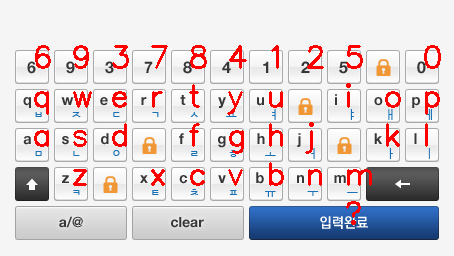
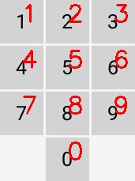

# 🖕⌨️ fuckvkeypad
[](https://github.com/psf/black)
[](https://github.com/soulee-dev/FuckVkeyPad/actions/workflows/black.yml)
[](https://codecov.io/gh/soulee-dev/FuckVkeyPad)





금융, 정부 웹사이트등에 널리 쓰이는 보안 프로그램인 가상키보드(vKeypad)를 우회합니다

**미리 각 키별 이미지를 저장해두고**, 저장한 이미지와의 유사도를 분석하는 방식으로 어떤 위치에 어떠한 키가 있는지 알수 있습니다

**키 배열이 무작위로 바뀌는 경우에도 인식이 가능합니다**

# 사용 방법
## vKeypad-Studio
각 키별 이미지와, 키보드상 좌표를 추출하기 위해 vkeypad-studio를 이용합니다.

이때 vkeypad-studio는 figma에서 그린 레이어의 위치를 분석해 이미지와, 좌표값을 저장해줍니다.

[사용 방법 영상 - YouTube](https://www.youtube.com/watch?v=4kE4m3oMGX8)
1. 가상키보드 이미지를 준비합니다
2. Figma에서 가상 키보드 이미지를 업로드 합니다
3. Figma에서 사각형으로 가상 키보드 각각의 키를 덮어줍니다
4. Figma에서 svg 파일로 Export 합니다
5. 터미널에서 ``vkeypad-studio [이미지 파일] [svg 파일]`` 을 입력합니다
6. 새로 뜬 창에서, 이미지에 해당되는 키보드 키를 눌러줍니다
7. assets 폴더 속 사진들과, data.json을 따로 보관 해둡니다

## fuckvkeypad
### 설치
```
pip install fuckvkeypad
```

### 예제
assets의 폴더 위치와, data.json 위치를 매개변수로 넘겨줍니다
```python
import cv2
from fuckvkeypad import get_keymap

img = cv2.imread("test_assets/vKeypad.png")
keymap = get_keymap(
    img, asset_path="test_assets/", data_path="test_assets/data.json"
)

print(keymap)
```

바운딩 박스의 좌표와 키코드를 순서대로 출력합니다
```python
[
  {"box": [0, 0, 55, 55], "key_code": 49},
  {"box": [58, 0, 113, 55], "key_code": 50},
  {"box": [116, 0, 171, 55], "key_code": 51},
  {"box": [0, 58, 55, 113], "key_code": 52},
  {"box": [58, 58, 113, 113], "key_code": 53},
  {"box": [116, 58, 171, 113], "key_code": 54},
  {"box": [0, 116, 55, 171], "key_code": 55},
  {"box": [58, 116, 113, 171], "key_code": 56},
  {"box": [116, 116, 171, 171], "key_code": 57},
  {"box": [58, 174, 113, 229], "key_code": 48},
]
```

# Special Thanks
이 라이브러리는[simple_bank_korea](https://github.com/Beomi/simple_bank_korea)에서 영감을 받아 제작하였습니다
